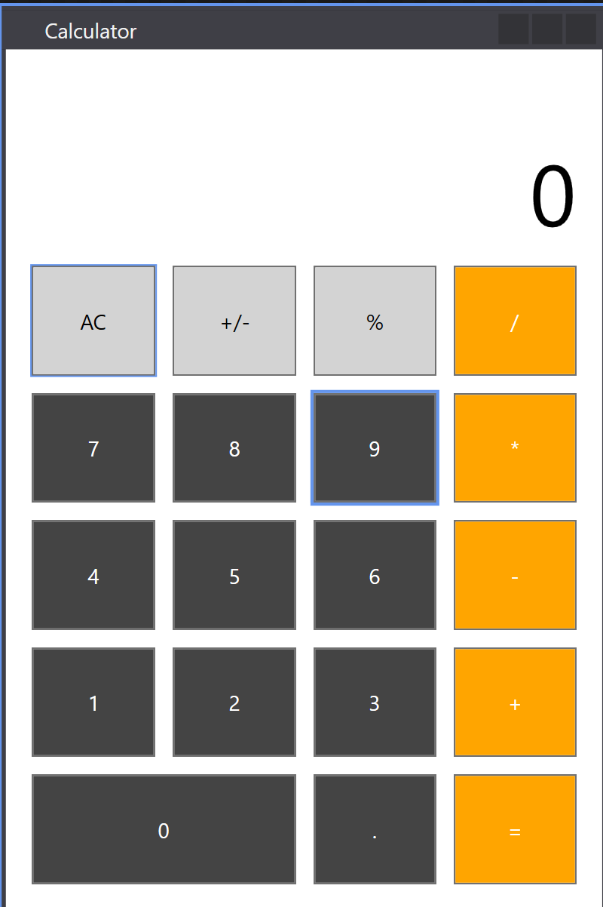

# Calculator WPF
* This is simple project I made for starting learning WPF. 
* Main focus is done on UI, not on logic, as I was exploring XAML and styles.
* However, there is a message box when division by zero happens.

